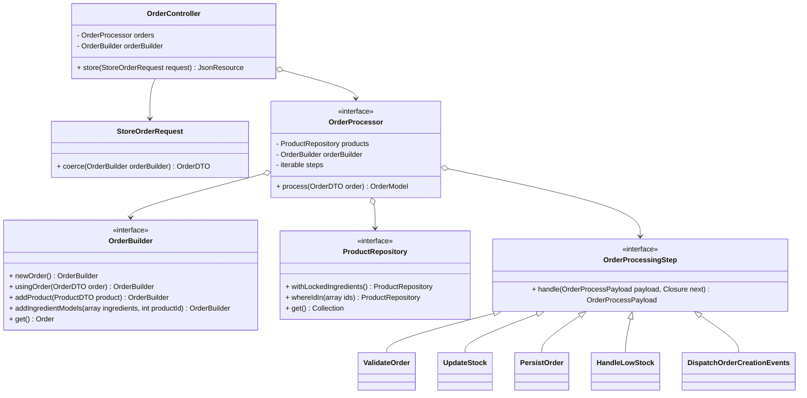
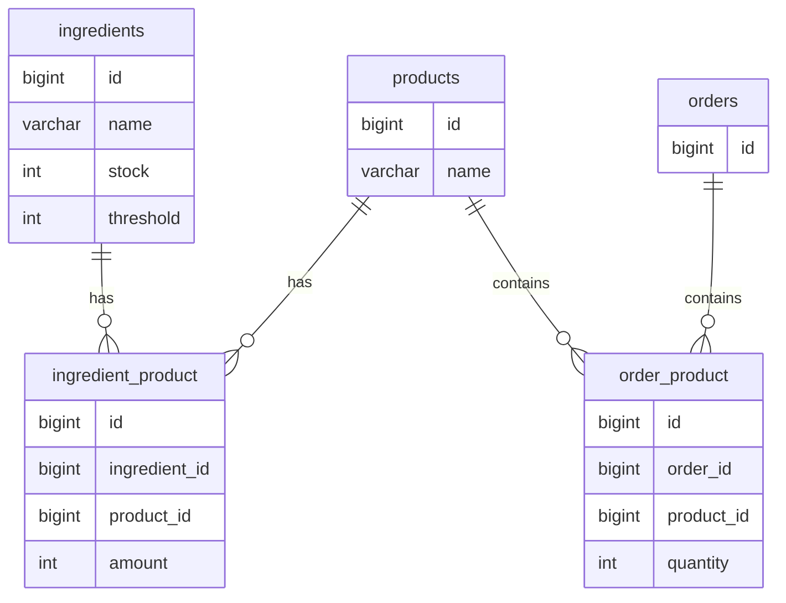

# Foodix

> [!NOTE]
> This project serves as a demonstration of technical proficiency and is created as part of the task provided by **Foodics**.

*Foodix* is a lightweight inventory and order management system designed to handle stock levels for ingredients, update inventory after orders, and notify merchants when ingredient levels drop below a specified threshold. 

* [Installation](#installation)
* [Assumptions](#assumptions)
* [Design Decisions](#design-decisions)
* [Architecture](#architecture)
* [Database](#database)
    * [Design](#design)
    * [Amounts](#amounts)
    * [Transaction](#transaction)
    * [Validation](#validation)
    * [Locking](#locking)
    * [Updating Stock](#updating-stock)
* [Testing](#testing)
    * [API](#api)
    * [Unit Testing](#unit-testing)
    * [Mutation Testing](#mutation-testing)
    * [Code Quality Tools](#code-quality-tools)

--- 

## Installation

This project runs locally using [Laravel Sail](https://laravel.com/docs/sail), for this, the only requirements to get up and running are **Docker** and **Docker Compose**.

Clone the repository then do the following:

```bash
cp .env.example .env
```

```bash
docker run --rm \
    -u "$(id -u):$(id -g)" \
    -v "$(pwd):/var/www/html" \
    -w /var/www/html \
    laravelsail/php83-composer:latest \
    composer install --ignore-platform-reqs
```

```bash
./vendor/bin/sail artisan key:generate
```

To start the containers, run:

```bash
./vendor/bin/sail up -d
```

And to stop them:

```bash
./vendor/bin/sail down
```

## Assumptions

The following assumptions were made to address ambiguities and scope limitations:
- **Stock Threshold for Notifications**

    The requirement specified sending an email notification when stock levels fall below *50%*. However, this percentage needs to be relative to a defined benchmark. To address this, a threshold column was added to the ingredients table, allowing the threshold to be customized for each ingredient.
    
- **Recipient for Email Notifications**

    The requirement stated that email notifications should be sent to the merchant. However, since user management is outside the scope of this task, the email is currently being sent to the first user in the database. This is intended purely for testing purposes.
    
- **Authentication and Authorization**

    As authentication and authorization were not part of the specified task, these features were not implemented.

## Design Decisions

The following design decisions were made to arguably balance maintainability, performance, and testability:

- **Repositories**

    While using Repositories with Active Record (in this case, Eloquent) can be a controversial choice, I opted for it as it makes testability a walk in the park

- **Threshold Breaching**

    Determining if the stock threshold has been breached could be done in multiple ways, including but not exclusive to:
  
    - Adding a dedicated flag in the database
    - Periodic batch processing to evaluate stock levels.
        
    My chosen approach, however, was to compute this dynamically at runtime, reducing storage overhead and removing the complexity of managing and syncing a precomputed flag.

- **Pipeline**

    Laravel’s built-in implementation of the *Pipeline* pattern provided an elegant and structured way to handle order processing. While other patterns like the Strategy pattern or chaining methods directly could have been used, the Pipeline pattern was chosen.

## Architecture

The system is designed with modular components to ensure extensibility, testability, and maintainability. Key highlights include:

- **OrderController**: Acts as the entry point, handling requests and delegating processing to **OrderProcessor**.
- **OrderProcessor**: Orchestrates order processing through a pipeline of steps, including validation, stock updates, and persistence, all running inside a database transaction.
- **OrderBuilder**: Dynamically constructs order objects, adding products, ingredients, and metadata.
- **ProductRepository**: Locks the relevant rows, and handles the queries for products and ingredients, ensuring consistency during stock operations.
- **Processing Steps**: Modular pipeline steps enable clear and reusable order processing logic.

Here is a class diagram providing an overview of the overall architecture:



## Database

### Design

The database design is straightforward, featuring three main tables: **orders**, **products**, and **ingredients**, connected through two many-to-many relationships.

Here's an overview of the schema:



### Amounts

To ensure precision and avoid issues with floating-point arithmetic and unit conversion, ingredient amounts are stored in the database as unsigned integers, representing _**grams**_.

```php
Schema::create('ingredients', function (Blueprint $table): void {
    // ...
    $table->unsignedInteger('stock')->default(0)->comment('Stock in grams');
    $table->unsignedInteger('threshold')->default(0)->comment('Threshold in grams');
    // ...
});
```

### Transaction

All operations related to order processing, including stock validation and updates, order persistence, and any associated actions, are executed within a single database transaction, ensuring data integrity by maintaining consistency across related operations.

```php
// App\Services\OrderProcessor

public function process(OrderDTO $order): Order
{
    return DB::transaction(function () use ($order): Order {
        // ...
    });
}
```

### Validation

While basic data validation is handled in the FormRequest for its convenience and simplicity, ingredient stock cannot be validated at this stage. Validating stock levels requires locking the relevant database rows to prevent race conditions and ensure accurate checks, which can only be performed within the transaction. For this reason, validating stock levels is performed as the first step in the order processing inside the **OrderProcessor** class.

### Locking

Pessimistic locking is used to ensure data integrity during order processing,preventing race conditions and ensuring that concurrent transactions do not interfere with one another.

```php
// App\Services\OrderProcessor

public function process(OrderDTO $order): Order
{
    return DB::transaction(function () use ($order): Order {
        $products = $this->products->withLockedIngredients()->whereIdIn(
            $order->products()->keys()->all(),
        )->get();

        // ...
    });
}
```

### Updating Stock

One of the highlights of the implementation is the use of a single SQL query to update all stock levels efficiently. This was achieved using a `CASE ... WHEN ... END` statement, allowing multiple updates to be performed in one query. This approach minimizes database round trips, improves performance, and ensures atomic updates, even in high-concurrency scenarios.

```php
// App\Pipeline\Order\UpdateStock

public function handle(OrderProcessPayload $payload, Closure $next): OrderProcessPayload
{
    // ...

    )->batchUpdateStock(
        $this->compileExpression($payload->dto->ingredients()->all()),
    );

    // ...
}
```

## Testing

### API

To manually try out the application, hit the `/orders` endpoint with a `POST` request.

### Unit Testing

The entire application is thoroughly tested using a combination of unit and feature tests. Every critical component and workflow has been covered. The test suite achieves a **100% coverage score**

To run the tests:

```bash
./vendor/bin/sail composer test
```

The coverage report is generated at: `.cache/reports/phpunit/index.html`


### Mutation Testing

To further ensure the robustness of the test suite, mutation testing was conducted.

To run the mutation tests:

```bash
./vendor/bin/sail composer mutate
```

The mutation report is generated at: `.cache/reports/infection/infection.html`


### Code Quality Tools

The following tools are used to ensure code quality and consistency:

- Laravel Pint
- PHPStan
- PHP Code Sniffer

You can run all these tools with a single command:

```bash
./vendor/bin/sail composer code:check
```
